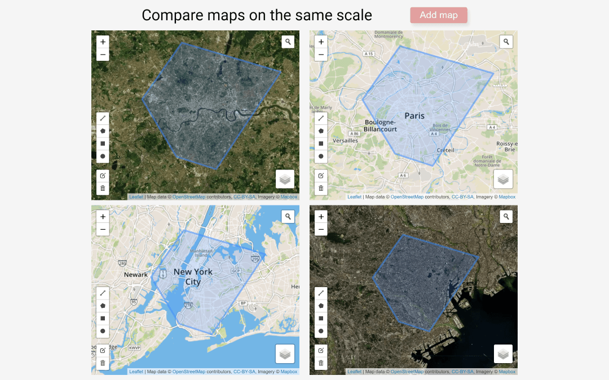

# compare-map

This app lets you compare maps on the same scale. You can also draw shapes on the map.



## Installing

You'll need an api key from mapbox. The key should be put in the hidden file `.env`:
```
API_KEY=<your key>
```
Install dependencies:

```$ npm install```

Build the app and run the server with `parcel`:

`$ parcel index.html`
